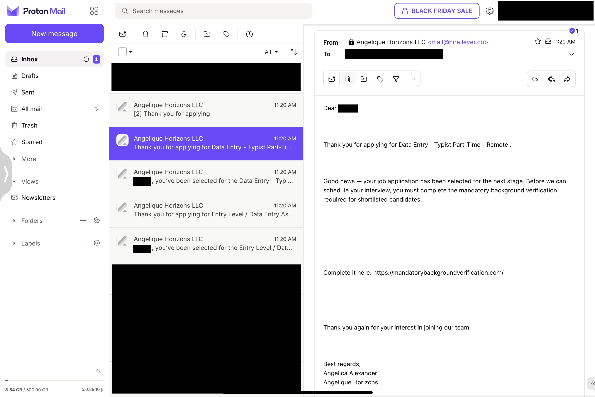

# Lever.co ATS Abuse – Legitimate Email, Malicious Intent (Nov 22, 2025)

## Summary
Received a fully authenticated next-stage interview email from Lever.co (SPF/DKIM/DMARC all pass) that linked to a fake background-check phishing site. The attack succeeded because the scammer created or compromised a real Lever employer account – not by spoofing email.

## Key Findings
- Email originated from official Lever/Mailgun IP 159.112.248.213  
- Valid DKIM signature (d=hire.lever.co)  
- Reply-To used standard Lever.co tracking address  
- Fraudulent employer: “Angelique Horizons LLC”  
- Phishing domain: hxxps://mandatorybackgroundverification[.]com (unrelated third-party)
- Phishing domain currently online (as of Nov 24, 2025)
- **Candidate never applied to any Angelique Horizons posting** — the fraudulent job was advertised under a different title/company name on FlexJobs solely to harvest applicant data for this phishing campaign

## Indicators of Compromise (IOCs)
- Phishing URL: hxxps://mandatorybackgroundverification[.]com/
- Lever Reply-To UUID: 5a19516a-e437-408a-a3d9-815b0997ca01  
- Fake employer name: Angelique Horizons LLC (and variations)

## TTPs & Red Flags (Tactics, Techniques, and Procedures)
- Requests mandatory “background verification” via third-party site before any interview
- Uses urgent language (“shortlisted for the interview stage”)
- Refers vaguely to “the remote position” instead of the actual job title applied for
- Sends multiple near-identical emails within seconds (automated mass-mailing)

## Scale of the Campaign
- Received 6 near-identical messages within 60 seconds from the same fraudulent Lever account
- Minor variations only in subject line and UUID in Reply-To header
- Indicates automated mass-mailing to all applicants of the fake job posting

## Lessons Learned
- Perfect email authentication no longer guarantees legitimacy when attackers abuse legitimate ATS platforms
- Background checks should never require candidates to visit random third-party sites or pay upfront fees
- Always verify the hiring company’s real domain and official career page before clicking any “verification” links

## Evidence (redacted)
- Raw email headers: [headers.txt](headers.txt)
- 6 similar emails, one shown here: 
- Phishing site appears in Google search "mandatory background verification": 
- Phishing landing page – full vertical scroll, captured 2025-11-24: 
*Full-page screenshot showing the entire fraudulent “TransUnion” verification funnel, including the $29.95 payment demand and fake FAQ section.*

This incident demonstrates practical phishing triage and why account-level abuse of trusted platforms (Lever.co, Greenhouse, Workable, etc.) has become the dominant job-scam vector in 2025.

## Reporting & Resolution Timeline

| Date       | Action                                                  | Status / Outcome                          |
|------------|---------------------------------------------------------|-------------------------------------------|
| 2025-11-22 | Incident discovered (6 phishing emails received)       | Documented                                |
| 2025-11-24 | Full triage completed; GitHub write-up published       | Completed                                 |
| 2025-11-24 | Phishing landing page safely captured (VPN + private tab) | Evidence added                           |
| 2025-11-25 | Fraudulent posting reported to FlexJobs (feedback@flexjobs.com)                 | Sent – plain-text report + all evidence attached                    |
| 2025-11-25 | ATS abuse reported to Lever (support@lever.co, Cc: privacy@lever.co)                            | Sent – plain-text report + all evidence attached                    |
|            |                                                         |                                           |
|     ...       | *(awaiting replies)*                     |                                           |

